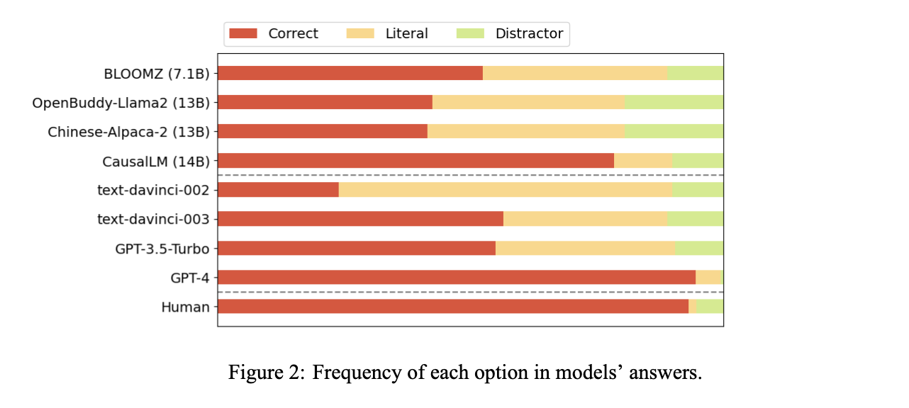

# llm-implicatures
This repository contains code and data used in the project **[Do Large Language Models Understand Conversational Implicature -- A case study with a chinese sitcom](https://arxiv.org/abs/2404.19509)**.

## Data Description 数据集介绍
**SwordsmanImp** contains the 200 Chinese dialogues extracted from the sitcom *My own Swordsman*. Within each of the dialogue, there is one character line conveying a non-literal meaning. We provides four interpretations for these lines with implicatures, which include a pragmatic and a literal explanations and two semantically related distractors. Moreover, the dialogues are analyzed with Grice's cooperative principle and are annotated with the Gricean maxims in violation. Following is an entry in the dataset.

Note that to prevent data contamination, we put the data in a zip file with the password: 0135.

**SwordsmanImp**包含了从情景喜剧《武林外传》中提取的200段人物对话。每个对话中都有一句人物台词包含言外之意。我们为这些含有言外之意的台词提供了四种解释，包括一个语用学范畴的解读，一个字面含义以及两个与上下文语境相关的干扰解读。我们用格Grice的合作原则对对话进行分析，并标注了每段对话所违反的Gricean maxim。以下是数据集中的一个条目。


为了避免数据污染，我们将数据放在一个zip文件中，密码为：0135。

### Meta information
|   |Total|Quantity|Quality|Relevance|Manner|
|----|----|----|-----|----|----|
|Number of questions|200|76|33|71|62|
|Number of turns per dialogue|6.80|7.84|5.91|6.23|6.35|
|Average dialogue length|158.22|184.53|143.67|147.20|152.79|
|Avergae utterance length|23.27|23.53|24.31|23.64|24.04|
|Average answer length| 15.08|14.47|14.85|15.82|14.86|

## Model performance
We tested eight open-source and close-source LLMs with our dataset. Here are the results:


See our [paper](https://arxiv.org/abs/2404.19509) for more details.

## Run the code
**Note:** You need to copy the Questions.xlsx unzipped from data.zip to the folders ```eval_chat``` and ```eval_logit``` to run the scripts.

### Free-form evaluation paradigms
Folder ```eval_chat/``` contains code to evaluate models' performance on this pragmatic task through their free-form responses. You should first enter your API keys in ```eval_chat/collect_api.py```. To collect answers from transformer models, use ```collect_api```, ```collect_transformer.py``` or ```collect_transformer_cpu.py``` based on the model and your device. For example, if you want to evaluate GPT-4, The command is

```python3 question_form.py sequence --all | python3 produce_prompts.py | python3 collect_api.py --model gpt-4 --expl_dir <FOLDER_NAME> --index```

The responses are collected in a CSV file in the target folder. You should collect their answers through regular expressions or manually. 

### Next word prediction paradigm
**Note:** The code used here is written by referring to [jennhu/lm-pragmatics](https://github.com/jennhu/lm-pragmatics).
Scripts in ```eval_logit/```  evaluate models' pragmatic understanding by collecting their prediction of the probability distribution of the next token after the prompt. Only open-source models are supported by this paradigm. You can run ```eval_logit/exp.sh``` to replicate results in our paper. Also, you can evaluate different models by changing the values after ```-n```(custom name for the model) and ```-m```(models' id on Huggingface). See more details of the parameters allowed in the scripts. 

**Columns in the result file:**

```condition```: The question type (represented by the Gricean maxim violated in the dialogue).

```choice_annotation```: The types of the four choices before randomizing the choice order (segmented with ##).

```choices_aft_rand```: The explanation type after randomizing the choice order (segmented with ##).

```correct_aft_rand```: The numeric index (starts from 1) of the correct answer. 

```temperature```: ranges between 0 and 1, adjusting the degree of random in LLMs' answer generation.

```distribution```: The predicted probability distribution of the four tokens (A, B, C, and D) to appear after the input prompt.

```model_answer```: Judged by the answer token assigned with the highest probability by the model. 

## Acknowledgements
We thank Xinjia Qi, Qiyu Sun and Yaqian Zhang
for verifying the implicatures and improving the
dataset. We also thank all anonymous participants
for their support in this study. This project is
funded by a Pujiang program grant (22PJC063)
awarded to Hai Hu.

## Citation
```
@misc{yue2024large,
      title={Do Large Language Models Understand Conversational Implicature -- A case study with a chinese sitcom}, 
      author={Shisen Yue and Siyuan Song and Xinyuan Cheng and Hai Hu},
      year={2024},
      eprint={2404.19509},
      archivePrefix={arXiv},
      primaryClass={cs.CL}
}
```

